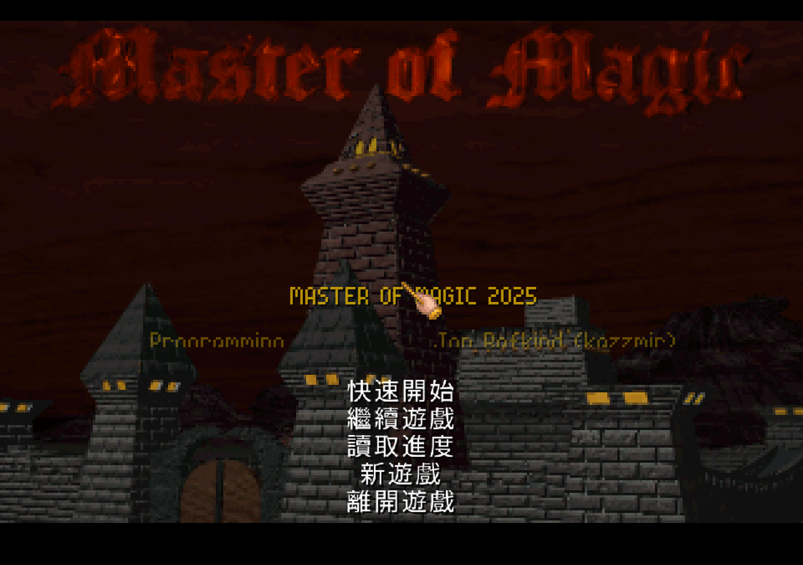
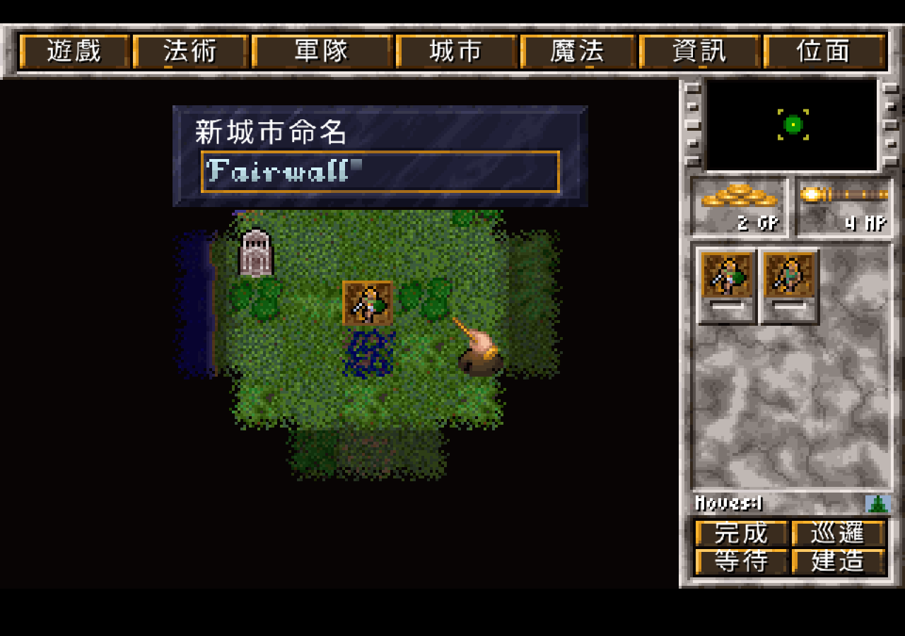
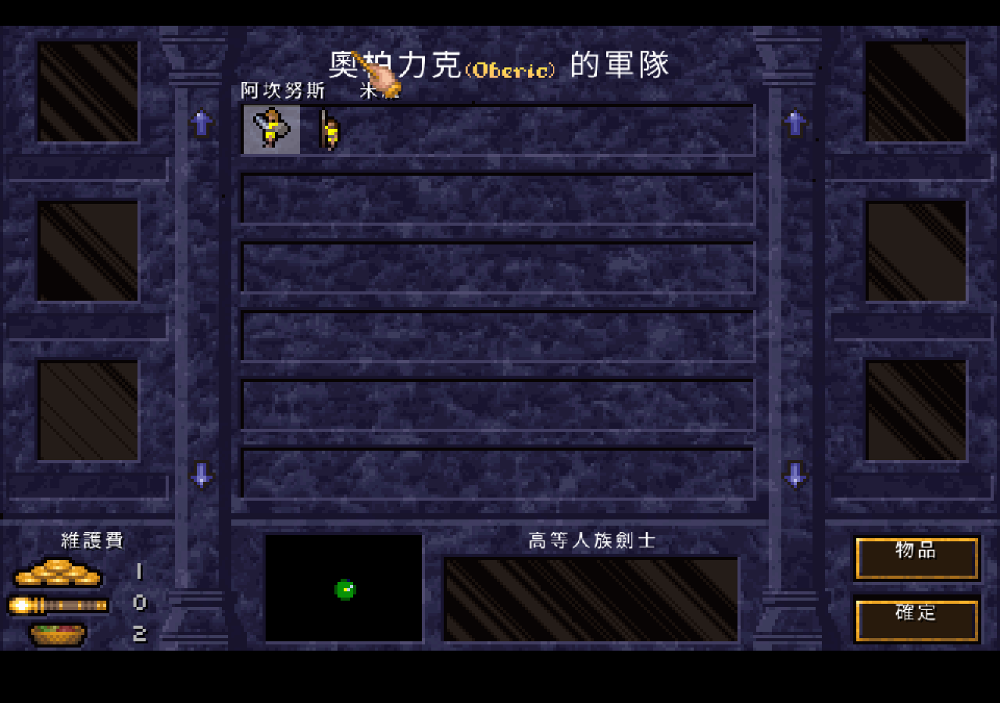
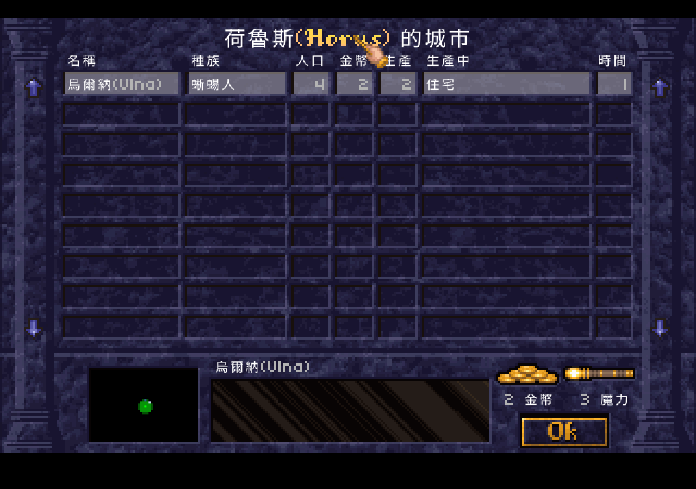
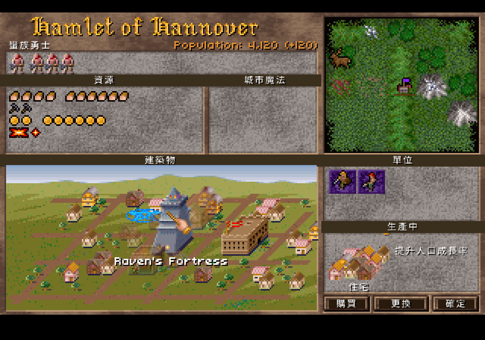
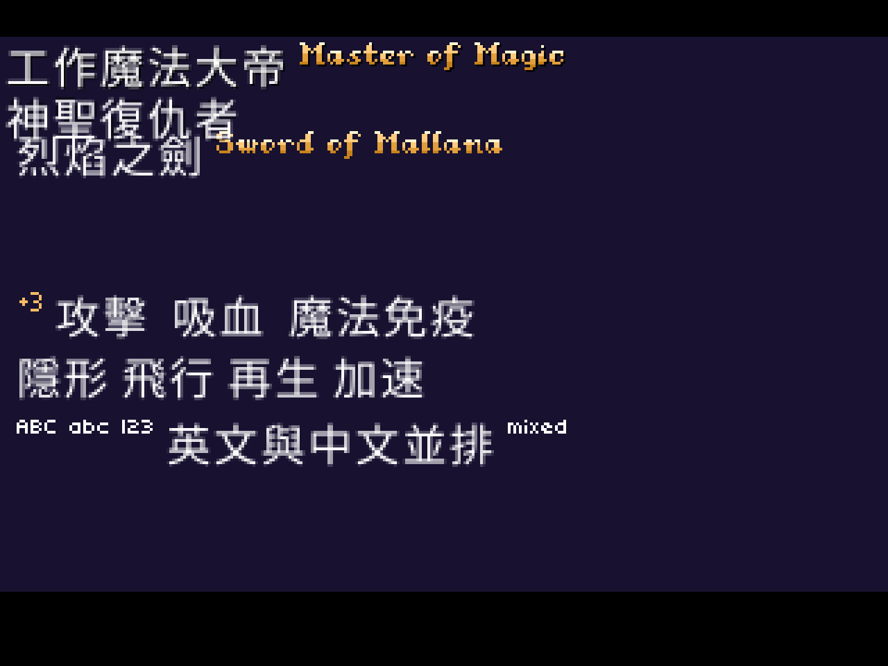
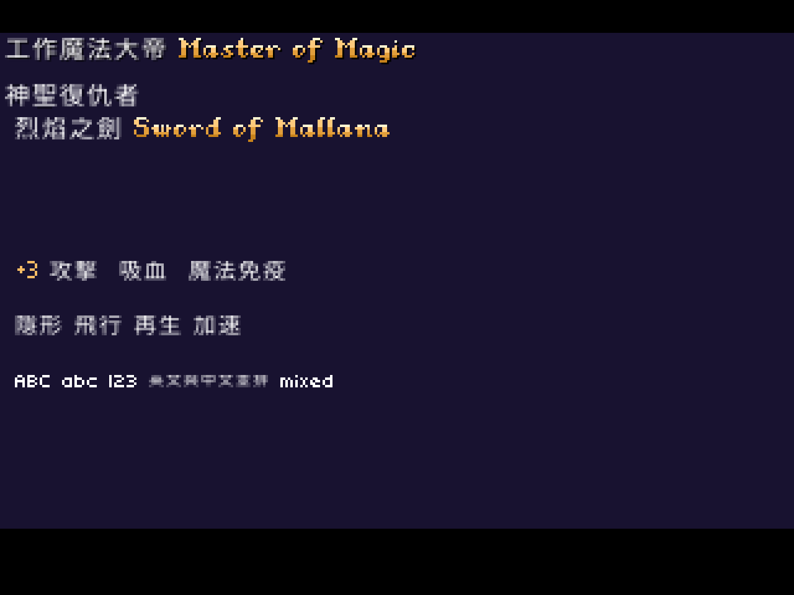

# 工作魔法大帝 繁體中文化 — Master of Magic (CHT)

那是 1994 年。SimTex 剛靠前一年的《Master of Orion》(銀河霸主) 在 4X 圈打響名號,轉頭就端出這款奇幻版的——
有人直接把它形容成「奇幻版的文明帝國 (Civilization)」。兩個位面、十四本魔法書、上百種法術與單位,
整套規則密得像一本原文教科書。而台灣玩家面對的,是一片全英文的羊皮紙介面,加上一本厚厚的英文手冊。

那個年代沒有 GameFAQ、沒有 Discord、沒有維基。你研究一條 nightshade 結界要花多久、Myrror 那面該先打哪、
神器附魔怎麼疊——這些大多得自己土法煉鋼,或等巴哈姆特往日遊戲板上某位前輩把英文 wiki 翻一翻貼上來。
華文圈關於這款遊戲的深度文字,幾乎都是事後的玩家回憶與自譯攻略,而非當年的一手雜誌評論。

值得一提的是它的口碑曲線。初版其實 bug 多、AI 差,被英文媒體電過;但官方一路 patch 到 1.31(1995 年 3 月),
把問題補得差不多,遊戲才翻身成奇幻 4X 的標竿——「4X」這個詞的發明者 Alan Emrich,
在 2001 年把它放上自己「史上最佳遊戲」名單的第一位;Eurogamer 在 2012 年回顧時下的結論是:
至今仍沒有任何奇幻 4X 超越它。

三十年過去,這款沒人完整漢化的策略神作,現在從頭到尾都說中文了:十四本魔法書、上百種法術與單位、
建築、城內百科、隨機事件、外交辭令、巫師與英雄的名字——**主要互動畫面全面中文化,可實際遊玩**。
每一批改動都用 AppImage 在 headless 下逐畫面截圖驗證,沒有「編譯過就算數」的僥倖。

這次不像《銀河霸主》(Master of Orion / 1oom) 那樣改 C 引擎。我們站在 kazzmir 用 **Go + Ebiten** 重製的引擎上——
它直接讀原版 `.lbx` 執行,不是模擬器,是把遊戲邏輯乾淨重寫的重製版。選它有一個很實際的理由:**跨平台**。
而且全程**不修改、不散布任何版權檔案**,只散布譯文表 + 引擎 patch + 字型子集。

當年華文電玩圈怎麼看這款遊戲、它的譯名到底叫什麼、為什麼這麼多年沒有中文版——
這段考古整理在 [`docs/history-chinese-reception.md`](docs/history-chinese-reception.md)。

---

## 中文化成果

到目前為止,譯文表累積 **3,200+ 條**(13 個 `docs/strings/*.tsv`),涵蓋:

| 範圍 | 量 | 說明 |
|---|---|---|
| 法術 / 神器 / 物品能力 | 528 | 法術名、神器名、附魔能力 |
| 建築名與描述 | 72 | 城市畫面建築、生產說明 |
| **城內百科 (help.lbx)** | 920 | 右鍵任何單位/建築/法術跳出的說明卷軸**本體**全中文 |
| help 卷軸標題 | 753 | 卷軸頂端的條目名(全大寫 headline) |
| 隨機事件 / 災害訊息 | 44 | 隕石、地震、瘟疫、聯姻、捐獻… |
| 動態數值模板 | 139 | 「花費 %v」「人口 %v」「無法對此城市施放 %v」這類組合句 |
| UI / 選單 / 對話 | 357 | 頂列選單、按鈕、確認與驗證對話 |
| 單位名(含種族合成) | 97 | 「蜥蜴人劍士」「高等人族矛兵」逐字合成 |
| **專有名詞 中文(英文)** | 328 | 巫師 14 + 英雄 35 + 城市 280,原文與中文並存 |

幾個玩起來最有感的地方:

**專有名詞保留原文。** 巫師、英雄、城市名走「中文(英文)」格式——你看得到中文,也認得出原文,
而且英文以小字並排、貼齊基線,不喧賓奪主。

**城內百科整本翻完。** 右鍵點任何建築、單位、法術,跳出的說明卷軸**本體**是完整中文,
換行、數值、維護費格式都對。

**連烘進按鈕圖、走哥德花體字的標題都換掉了。** 位圖按鈕用「擦底色 + 疊銳利中文」處理,
help 卷軸標題走引擎本來的華麗標題字渲染中文。

---

## 為什麼是 Go / Ebiten 引擎

這次不像《銀河霸主》那樣改 C 引擎(1oom)。我們站在 kazzmir 用 **Go + Ebiten** 重製的引擎上——
它直接讀原版 `.lbx` 執行,不是模擬器,是把遊戲邏輯乾淨重寫的重製版。選它有一個很實際的理由:**跨平台**。

Ebiten 原生支援 Windows / macOS / Linux / Android / iOS / Web,而且上游**已經把 Web (WASM) 版部署到 itch.io**。
換句話說,語言不是跨平台瓶頸;真正的成本在「打包簽章」與「觸控/檔案存取 UX」,那是換成 C++ 一樣得做、甚至更麻煩的事。
完整評估見 [`docs/porting-difficulty.md`](docs/porting-difficulty.md)。

對中文化來說還有一個甜頭:引擎的字串繪製迴圈本來就走 `for _, c := range text`(rune / UTF-8 迭代),
只是非 ASCII 的字被靜默丟棄。所以我們不必重寫整條點陣管線,只要在 glyph 查找處加一條
「碼點 ≥ 0x80 → 改用 CJK 字形來源」的支線即可。

---

## 現在到哪了

### 已完成

**Phase 0 — 盤點與骨架**
盤點原版 142 個 LBX 資產、clone 引擎、摸清字型 / LBX / 渲染架構,確立 patch-only 散布原則,
建好 `PLAN.md` / `CONTEXT.md` / ADR 骨架。

**Phase 1 — CJK 渲染注入(已驗證)**
不只在獨立 prototype 把一行中文畫上畫面,更進一步在**真實引擎字型管線**(`lib/font` + 真實 `fonts.lbx`)上,
讓中文走完引擎三條繪字路徑——`doPrint` / `PrintOutline` / `MeasureTextWidth`——全部正確渲染。
英文續用引擎原本的金色花體點陣字,中文用 Noto Sans CJK TC。注入點集中在新增的 `lib/font/cjk.go`
與一份 patch(`patches/0001-cjk-font-injection.patch`),不碰版權檔。技術路線決策見 [ADR 0001](docs/adr/0001-cjk-rendering.md)。

*上圖是真實引擎(非 prototype)跑出來的畫面。看「神聖復仇者」「烈焰之劍」這些中文如何和原版金色英文標題並排——這證明三條繪字路徑都吃中文了。也正是這張圖暴露了 `PrintOutline` 一開始漏 patch、以及中文字級偏大導致行距重疊兩個問題。*

跑真畫面的價值就在這裡:CI 編譯全綠不代表畫面對。這一畫面當場逼出兩個必修項——`PrintOutline`
漏 patch(已修)、CJK 字級未對齊引擎字高造成行距重疊。

**Phase 2 第一刀:字級對齊(已完成)。** 把 `cjkGlyphImage` 改成 size-aware——依呼叫端字型的
`GlyphHeight` 決定 CJK 渲染尺寸、以 (rune, height) 為快取 key、各字高一份 face,三條繪字路徑都傳入字高。
結果中文不再溢出行高、與英文基線對齊、各行不再重疊:

*同一段中英混排,經字級對齊後的樣子。和上一張比,「神聖復仇者」「烈焰之劍」不再壓到下一行,中英文坐在同一條基線上。trade-off:最小字型下中文偏小,密集面板日後可走 hi-res canvas 或固定尺寸點陣補強。*

下面這張是更早的獨立 prototype 截圖,驗證「逐 rune 預渲染 + 快取」這條注入支線本身可行:

**版本決策(ADR 0002,已實測)**
目標版本定為 **Community Patch 1.60**(對齊引擎邏輯與測試基準),同時保留 **vanilla 1.31** 相容——
做法是譯文表以「英文原文字串」為 key。我們實際用 MOMDIFFP 把正版 1.31 升級到 1.60、對前後字串做 diff,
得到一個關鍵結論:CP 1.60 維持所有**名稱**字串不變(改的是數值平衡與重寫散文),
所以神器名 / 物品能力 / 法術名的譯文表**一份通吃兩版**;只有 help / 建築描述 / 訊息這類散文須以 1.60 為準重抽。
實測 diff 細節見 [ADR 0002](docs/adr/0002-target-game-version.md)。

**譯文表**
全部譯文以「英文原文 → 繁中」逐行存在 [`docs/strings/`](docs/strings/)(13 個 `.tsv`),
英文原文即 key,所以同一份表 1.31 / 1.60 通用。玩家實測回報的未翻項追蹤在
[`docs/worklist.md`](docs/worklist.md)。

**Phase 2 / 3 — 全面中文化(已完成主體)**
字串覆蓋層(`lib/font/override.go`,載入後 TrimSpace 精確比對,不碰版權 LBX)成形後,
譯文一路鋪到 3,200+ 條:法術 → 神器 → 建築 → **城內百科 help.lbx** → 單位名(含種族合成)→
隨機事件 → 動態數值模板 → 專有名詞中英並存。內嵌字型子集(Noto Sans CJK TC,~1,700 字)
隨打包,出包零外部依賴。20+ 畫面用「擦底色 + 疊銳利中文」處理烘進背景的英文按鈕與標題。
每一批都用 dist AppImage 在 headless 下逐畫面截圖驗證。

**重現經典 + 設定補完(2026-06)**
不只翻譯,也修玩法。玩家回報的 10 個問題逐項處理(6 修 4 證偽,見下方「不只翻譯,也修對遊戲」),
原版設定畫面缺的選項補回 16 項(全自動戰鬥、音效/音樂、隨機事件、法術動畫、敵方施法通知、自動結束回合、
回合總結、自動建議…,全中文),並加了閃退記錄。逐項根因/手冊 oracle/測試見
[`docs/classic-rules-plan.md`](docs/classic-rules-plan.md)。

**三平台打包 + 公開 Release**
Linux AppImage / Windows / macOS(arm64,GitHub Actions)都已建好最新版。
[GitHub Release v0.1](https://github.com/wicanr2/master-of-magic-cht/releases) 提供三平台的 **data-free** 安裝包
(不含版權遊戲檔,玩家自備),白話版說明見 [`docs/RELEASE-NOTES.md`](docs/RELEASE-NOTES.md)。

### 待辦

- **次要邊角**:極少數動態列舉引數、純數值 tooltip,以及城市名池外的玩家自訂名(本就保留原文)。
- **原版觀感**:設定畫面已加「**DOS 原版長寬比**」開關(畫面垂直拉伸 1.2 倍還原 4:3,讓老玩家更有年代感);
  CRT 質感 shader 仍可選做。分析與對比圖見 [`docs/dos-vs-remake-ui.md`](docs/dos-vs-remake-ui.md)。
- **剩餘設定**:Event Music、Expanding Help 兩項原版設定未做(低價值)。
- **跨平台延伸**:Web WASM / Android,順序與理由見 `docs/porting-difficulty.md`。

---

## 不只翻譯,也修對遊戲

這個專案的目標不只是把字變中文,而是讓它玩起來就是老玩家記憶中的經典。玩家實測回報的玩法疑點,
我們逐項用「原始碼追根因 + 單元測試重現 + 對照原版手冊」處理,且每個會動到戰鬥/數值的修正都用旗標包住,
預設保留重製原版行為、可在主選單切到經典強化版對照。逐項根因、手冊頁碼與測試見
[`docs/classic-rules-plan.md`](docs/classic-rules-plan.md)。

過程中也釐清了幾個「看起來像 bug、其實是原版規則」的情況——這類更要查證,免得把正確機制改錯。最典型的一個:

> **「我只有白綠藍三色書,沒有紅(混亂)書,戰鬥時法術書裡卻出現混亂系法術?」** 這不是洩漏,而是原版設計。
> 法術研究嚴格依持有書系過濾(沒紅書就研究不到任何混亂法術,單元測試可證);你戰鬥中看到的他系法術,
> 來自**召喚到的英雄自帶的法術**。原版手冊第 82 頁的英雄能力「Inherent Spell Knowledge」白紙黑字寫著:
> 這些英雄專屬法術「不必然屬於巫師的法術書,且在戰鬥中出現」。所以一位混亂系英雄帶幾發混亂法術上陣,
> 完全符合原版規則,不該被當成 bug 修掉。

---

## 這份 repo 放什麼 / 不放什麼

patch-only。本 repo **不 vendor 引擎本體、不散布任何版權遊戲檔**,玩家自備正版資料即可套用。

| 放 | 不放(版權,列入 `.gitignore`) |
|---|---|
| 計畫 `PLAN.md`、術語 `CONTEXT.md`、決策 `docs/adr/` | 原版遊戲檔(`.lbx` / `.exe` / 手冊) |
| 英文 → 繁中譯文表 `docs/strings/*.tsv` | 引擎本體(由 `scripts/fetch-engine.sh` 取得) |
| CJK 渲染 patch、字型烘製腳本、prototype | 解壓出的任何版權資產 |

譯文表是本專案的衍生資產,版權 LBX 分毫未動。

---

## 文件導覽

| 文件 | 內容 |
|---|---|
| [`PLAN.md`](PLAN.md) | 單一真實計畫來源,階段規劃與進度回填 |
| [`docs/strings/`](docs/strings/) | 13 個英文 → 繁中譯文表(3,200+ 條,英文原文即 key) |
| [`docs/worklist.md`](docs/worklist.md) | 玩家實測回報的未翻項追蹤與修正紀錄 |
| [`docs/RELEASE-NOTES.md`](docs/RELEASE-NOTES.md) | 版本說明(白話:修了什麼、補了哪些設定、怎麼安裝) |
| [`docs/classic-rules-plan.md`](docs/classic-rules-plan.md) | 重現經典:10 個玩法 issue 處理 + 原版 18 項設定狀態(逐項根因/oracle/測試) |
| [`docs/mom-strategy-notes.md`](docs/mom-strategy-notes.md) | MoM 策略筆記(5+ 份攻略歸納)+ 自動建議規則依據 |
| [`docs/dos-vs-remake-ui.md`](docs/dos-vs-remake-ui.md) | 原版 DOS vs 重製引擎的介面差異分析(為何「沒 DOS 感」)|
| [`docs/localization-methodology.md`](docs/localization-methodology.md) | **Go/Ebiten 老遊戲繁中化方法論 + 踩雷清單**(可重用 playbook) |
| [`CONTEXT.md`](CONTEXT.md) | 專案術語表(ubiquitous language) |
| [`docs/phase1-cjk-prototype.md`](docs/phase1-cjk-prototype.md) | Phase 1 渲染驗證全紀錄(含真實引擎截圖與必修項) |
| [`docs/porting-difficulty.md`](docs/porting-difficulty.md) | 跨平台移植難度評估(為何維持 Go,不重寫 C++) |
| [`docs/adr/0001-cjk-rendering.md`](docs/adr/0001-cjk-rendering.md) | CJK 渲染路線決策(TTF 為主線,點陣為美術升級選項) |
| [`docs/adr/0002-target-game-version.md`](docs/adr/0002-target-game-version.md) | 目標版本 = CP 1.60,1.31 相容,附實測字串 diff |
| [`docs/history-chinese-reception.md`](docs/history-chinese-reception.md) | 魔法大帝當年在華文電玩圈的譯名考據與接受史 |

---

## 參考

- 引擎:<https://github.com/kazzmir/master-of-magic>
- 銀河霸主(Master of Orion 1, 1oom)繁中化前例:patch-only,24×24 CJK 管線
