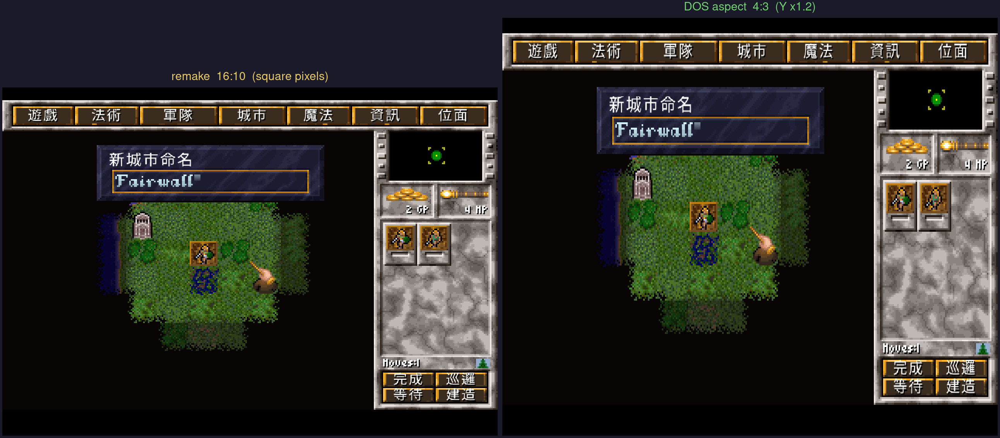

# 原版 DOS vs 重製引擎(kazzmir Go/Ebiten)的介面差異

有玩家反映「重製版玩起來沒有當年 DOS 的感覺」。這份報告**用實際截圖逐畫面比對**原版 DOS 與重製版,
找出真正的差距並指出主因。結論放最前面。

> 方法:① 從 [My Abandonware 的 MoM DOS 頁面](https://www.myabandonware.com/game/master-of-magic-21t)
> 抓原版 DOS 截圖(選巫師 / 選種族 / 大地圖×2 / 施法場景),與本專案重製版截圖(`docs/img/`)**目視逐畫面比對**;
> ② 直接查引擎原始碼驗證(`scale`/`main.go`/`fonts`)。標「已驗證」的為原始碼直接佐證、「已比對」的為截圖目視。

## 結論(先講):遊戲內 UI 忠實(原版 LBX + 原版座標),差在「顯示層」;**唯一的介面改動是主選單多了重製版字幕**

**遊戲內畫面**(大地圖、城市、戰鬥、施法、各清單)的美術與佈局與原版 DOS 一致——重製版直接讀原版
`.lbx` 並把元件畫在**原版座標**(已逐處對照原始碼,見下「逐項」與更正框)。所以「沒 DOS 感」主因**不是介面被重新設計**,而是顯示層。

但「忠實」要講精準,有一個**真正的介面改動**別漏:**主選單(`mainscrn.lbx` 城堡底圖是原版的)上,重製版疊了自己的製作群字幕**
——「MASTER OF MAGIC 2025 / Programming: Jon Rafkind (kazzmir)…」+「MASTER OF MAGIC 1994」(`mainview/view.go:207-213`,原版沒有)。
這是除了顯示層外、唯一肉眼可見的「非原版」元素。其餘(開場動畫 `intro.lbx`、選單城堡底圖、遊戲內 HUD)都用原版資產。

真正造成落差的是**顯示層**(把同一份美術「呈現出來」的方式),三大主因:

1. **長寬比沒做 CRT 校正(影響最大)** — 原版 320×200 在 4:3 CRT 上被**垂直拉高約 20%**顯示;
   重製版用方形像素整數倍放大(960×600,16:10),沒把 Y 拉 1.2 倍 → 畫面整體**偏扁偏寬**,
   巫師臉、UI 框比記憶中「矮胖」。**注意**:My Abandonware 那些 DOS 截圖也是用方形像素存的(320×200 直接放大),
   所以「截圖 vs 截圖」兩邊一樣扁——這個差異只在**真實 CRT 上玩**或做了校正才看得出來。
2. **缺 CRT 質感** — 原版 CRT 是柔化+掃描線+螢光暈;重製版最近鄰銳利放大,LCD 上是**硬邊方塊**,乾淨但冷。
3. **音樂音色不同** — 原版 OPL FM / MT-32;重製版 MIDI 合成器 + SF2 soundfont(GM 取向)。氛圍記憶落差大。

**右側 HUD「看起來不一樣」其實是狀態差,不是改版**(常見誤會,已逐處對照原始碼):右側面板有兩種狀態,
DOS 與重製版都一樣——
- **沒選單位**:小地圖 → 金/法力庫存(`X GP`/`X MP`)→ 金/食/法力**收入**面板 → **Next Turn** 鈕。
  重製版這塊畫的是**原版 `main.lbx 34`** 面板,座標 `(240,77)`、收入字 `(278,103)/(278,135)/(278,167)`、
  Next Turn `(240,174)`、庫存 `(276,68)/(314,68)`(`game/magic/game/game.go` `MakeHudUI`)——**與原版逐項對齊**。
- **選了單位**:同位置改顯示單位列 + 完成/巡邏/等待/建造(`main.lbx 8–11`)。

把「DOS 沒選單位的圖」拿去比「重製版選了單位的圖」就會誤判成排版不同;同狀態比則一致。字型也忠實
(英文沿用 LBX 點陣字,常被誤會,見下)。

> **更正(2026-06,第一性原理覆核)**:本報告初稿曾寫「頂部七顆選單鈕 DOS 緊貼、重製版較分散」。
> 進一步看引擎原始碼後確認這是**誤判**:頂部按鈕在 `game/magic/game/game.go` 的 `MakeHudUI()` 是
> **硬定位**在 `x = 7,47,89,140,184,226,270`(全 `y=4`),疊在原版 HUD 底圖 `main.lbx 0` 上 ——
> 必須對齊原版框格。座標**不規則**(軍隊→城市差 51px、其餘約 40–44px)正是「照原版量出來」的指紋
> (自行重排會用等距)。所以按鈕間距**已是 DOS 原版**,初稿的「分散」印象來自未校正長寬比把橫向擠寬的錯覺。
> 沒有「重製版亂排」可收緊;硬做「緊貼版」反而會偏離原版並與 HUD 框錯位。

---

## 規格基準

| | 原版 DOS(1994)| 重製版(kazzmir Go+Ebiten)|
|---|---|---|
| 引擎 | 原生 DOS 執行檔 | Go + Ebiten,**直接讀原版 `.lbx` 資產**(非 DOSBox 模擬)|
| 邏輯解析度 | 320×200(256 色 VGA)| 320×200(`data.ScreenWidth/Height` 已驗證)|
| 實際顯示 | CRT 拉成 4:3,**像素長寬比 PAR ≈ 1:1.2**(垂直伸長 20%)| 方形像素 ×3 → **960×600(16:10)**,無長寬比校正(已驗證 `Layout = Scale2(320,200)`)|
| 縮放濾鏡 | CRT 類比柔化 | 預設**最近鄰**(`ScaleAmount=3.0`、`ScreenScaleAlgorithm=Normal` 已驗證);另有 Scale2x/XBR 可選 |
| 字型 | LBX 內金色哥德點陣字 | **沿用同一份 LBX 點陣字**(英文走 `LbxFont`,已驗證);繁中化只對 CJK 注入 TTF |
| 音樂 | OPL FM / MT-32 | 內建 MIDI 合成器 + SF2 soundfont |
| 視窗 | 全螢幕 CRT | 預設視窗化 |

---

## 差異清單(逐項)

### 1. 長寬比未校正 ★最關鍵
- **原版**:320×200 在 4:3 CRT 上垂直拉伸至約 320×240,PAR ≈ 1:1.2;美術都是依此比例設計、看起來才「對」。
- **重製版**:方形像素整數倍,輸出 960×600(16:10),Y 沒有多乘 1.2。
- **為何沒 DOS 感**:所有圖形**偏扁約 20%**,巫師肖像、地圖、面板輪廓和記憶對不上。最廣、最客觀的失真。
- **可信度:高(已驗證 + 第一性原理推導 + 權威來源)**。`Layout` 回 `scale.Scale2(320,200)` = 960×600 方形像素,無 1.2 Y 校正。

> **第一性原理推導(為什麼是 1.2 倍,不是「美術記憶」)**
> 1. VGA Mode 13h 的影像記憶體是 320×200,但硬體實際**掃 400 條掃描線**——每一列像素用**兩條連續掃描線**
>    顯示(scan-doubling),填滿 CRT 的 4:3 顯示區。
> 2. 邏輯影像 320×200 = 16:10 = **1.6**;顯示器 = 4:3 = **1.333**。把 16:10 的影像填進 4:3 的框,
>    垂直必須拉伸 1.6 ÷ 1.333 = **1.2 倍** → 每個像素「高是寬的 1.2 倍」(PAR 1:1.2,即 6:5)。
> 3. 結論:一個畫成 N×N 像素的圓,在原版 CRT 上會顯示成 N 寬 × 1.2N 高(看起來是正圓);
>    重製版把它當 N×N 方形像素畫(960×600),就變成「太扁的橢圓」——這是幾何層的客觀失真,
>    與美術、字型、記憶都無關。**正確輸出應把 Y 乘 1.2(等效渲染成 320×240 再放大)。**
>
> 來源:[Wikipedia: Mode 13h](https://en.wikipedia.org/wiki/Mode_13h)(400 掃描線 / line-doubling)、
> [VOGONS: True aspect ratio of VGA mode 13h](https://www.vogons.org/viewtopic.php?f=9&t=17110)、
> [Nerdly Pleasures: Oddball EGA/VGA Resolutions](http://nerdlypleasures.blogspot.com/2014/09/oddball-ega-and-vga-resolutions-when.html)、
> [Hacker News: 320×200 PAR 1:1.2](https://news.ycombinator.com/item?id=20206016)。

### 2. 缺 CRT 質感(掃描線 / 柔邊 / 暈光)
- **原版**:CRT 把大像素模糊柔化、帶掃描線與螢光暈,色塊間是漸層,觀感溫潤。
- **重製版**:最近鄰銳利放大,LCD 上是硬邊方塊,無掃描線、無柔邊。
- **為何沒 DOS 感**:記憶中的「DOS 感」很大一部分是 CRT 質地;銳利方塊反而「更不像當年」。
- **可信度:高(已驗證預設最近鄰)**。

### 3. 音樂音色(SF2 GM vs OPL/MT-32 FM)
- **原版**:OPL2/OPL3 FM 合成或 MT-32 的標誌音色。
- **重製版**:MIDI 合成器 + SF2(GM 取向)。
- **為何沒 DOS 感**:聽覺記憶落差直接影響「氛圍對不對」。
- **可信度:高**(引擎說明明載 MIDI+SF2)。

### 4. 版面忠實(原版 LBX + 原版座標),逐處對照原始碼確認
- **重製版**:讀原版 `.lbx` sprite/底圖,把元件畫在**原版座標**(非自由重排)。
- **逐處對照(原始碼)**:
  - 頂部七顆選單鈕:`MakeHudUI()` 硬定位 `x=7,47,89,140,184,226,270`(對齊原版 HUD 底圖 `main.lbx 0`)。
  - 右側沒選單位面板:`main.lbx 34` @ `(240,77)`、金/食/法力收入字 @ `(278,103/135/167)`、Next Turn @ `(240,174)`、
    庫存 @ `(276,68)/(314,68)`——與原版 DOS 截圖逐項對齊(見上方結論)。
  - 選了單位:完成/巡邏/等待/建造 = `main.lbx 8–11`。
- **互動行為**有些不同(開發者承認 minimap 不可點、縮放層級是後加的),但那是操作不是視覺版面。
- **可信度:高(原始碼座標 + 截圖比對)**。

### 4b. 真正的「非原版」介面元素:主選單製作群字幕 ★唯一改動
- **重製版**在主選單(底圖 `mainscrn.lbx` 是原版的)**疊了自己的字幕**:「MASTER OF MAGIC 2025 /
  Programming: Jon Rafkind (kazzmir) / Marc Sommerhalder / Vlad Kovun」+「MASTER OF MAGIC 1994」
  (`mainview/view.go:207-213`)。原版主選單沒有這段。
- 這是顯示層以外**唯一**肉眼可見的介面差異;屬重製版署名,非缺陷。若要更貼原版,可把這段 credits 關掉/淡化
  (不影響玩法)。**開場動畫(`intro.lbx`)與選單城堡底圖本身都是原版**。
- **可信度:高(原始碼直接可見)**。

### 5. 字型其實忠實(澄清常見誤判)
- **原版 vs 重製版**:重製版**直接沿用 LBX 原始點陣金色哥德字**,英文字形 1:1,**沒有換成 TTF**。
- **為何容易誤會**:疊在第 1、2 點之上——同樣的點陣字,被方形像素+無 CRT 柔化呈現,看起來比記憶中「硬」,
  但那不是字型換了,是**顯示鏈差了**。
- **可信度:高(已驗證)**。英文走 `font.LbxFont`;繁中化只對 CJK 走 TTF,英文不動。

### 6. 滑鼠游標 / 動畫時序(次要、推測)
- 重製版 Ebiten 固定 60 TPS 重跑時序;游標慣性、動畫快慢的微差可能累積成「不是當年那台」的感覺。
- **可信度:低**(合理推測,未逐項公開驗證)。

---

## 讓重製版更接近 DOS 觀感

### ✅ 已實作:DOS 原版長寬比切換(設定畫面)

設定畫面新增「**DOS 原版長寬比**」開關(預設關)。開啟時把最終畫面**垂直拉伸 1.2 倍**,還原原版
320×200 在 4:3 CRT 上的比例。下圖是同一個大地圖畫面,左為重製版(16:10 方形像素)、右為 DOS 觀感
(4:3,Y×1.2)——右邊整體變高,地形、單位、巫師肖像、選單列的輪廓回到老玩家記憶中的比例:

> 實作(第一性原理):遊戲邏輯/座標**完全不變**仍在 960×600 算;只在最終呈現時 `Layout` 改回 4:3、
> 把畫面畫到未拉伸的離屏 buffer 再 `GeoM.Scale(1, 1.2)` 貼出;滑鼠座標在 `scale.CursorPosition()` 一併
> 把 Y 除回 1.2,確保點擊/選格不偏。改動集中在 `data.Settings.DosAspect` + `scale`/`main.go` 三處,純顯示層。
> (上圖是把這個 Y×1.2 變換套到真實大地圖截圖產生的對比,即開關的精確效果。)

### 其他可調方向(尚未做)
- **CRT 後製 shader**:用 Ebiten Kage 寫一個 post-process pass,加掃描線 + 遮罩 + 輕微 bloom/blur,模擬 CRT 柔化。
- **音樂**:改走 OPL/AdLib 模擬或 MT-32(munt)還原原音色;若留在 GM,至少換一個接近 Roland 的 SF2。
- **palette**:確認沿用 LBX 的 VGA 256 色盤(引擎本就讀 LBX 色盤,屬低風險檢查項)。
- **字型**:**維持沿用原 LBX 點陣字**,英文別 TTF 化;「字看起來硬」交給長寬比 + CRT shader 解決,不是改字型。

> 對本繁中化專案的意義:這些都是**引擎層**的觀感差異,與中文化無關(中文化只動顯示層字串覆蓋 + CJK 字形)。
> 若要追求 DOS 觀感,優先做「長寬比校正」與「可選 CRT shader」,且都用**設定開關**包住、預設維持現況,
> 與本專案「修正用旗標守護、預設不變」的原則一致。

## 其實是原版本來就有、屬玩家記憶誤差的「差異」

- **「介面被重新設計、跟原版不一樣」**:**遊戲內 UI 美術與佈局一致**(重製版讀原版 LBX、原版座標);
  違和感來自顯示層(長寬比 / CRT / 音色)。**唯一**真正的非原版介面元素是**主選單的重製版製作群字幕**(見 §4b)。
- **「右側 HUD 排版跟原版不一樣」**:多半是拿「DOS 沒選單位」比「重製版選了單位」——那是**同 UI 的兩種狀態**
  (見 §4),同狀態比則逐項對齊原版座標。
- **「開頭底圖不一樣」**:多半是拿「原版開場標題卡(`intro.lbx`)」比「重製版主選單(`mainscrn.lbx`)」——
  那是**兩個不同畫面**;重製版兩者都用原版資產,只是選單上多疊了製作群字幕。
- **「重製版像素太大太低解析」**:320×200 是原版真實規格,不是重製版降規。
- **「原版比較銳利清楚」**:相反——原版在 CRT 上是偏**模糊柔化**的;記憶中的「清楚」多半是腦補,
  重製版的銳利其實「比原版更不像原版」。
- **「字型被換掉了」**:沒換,英文沿用 LBX 原點陣字。
- **icon 面板、右鍵資訊卷軸、金色標題字**:都保留,屬忠實還原。

> 來源補充:DOS 截圖取自 [My Abandonware — Master of Magic (DOS)](https://www.myabandonware.com/game/master-of-magic-21t)
> 的官方截圖庫(選巫師 / 選種族 / 大地圖 / 施法場景),與本專案 `docs/img/` 的重製版截圖目視比對。
> (版權考量:DOS 原版截圖不入本 repo,僅引用 My Abandonware 連結。)

## 來源

- [kazzmir/master-of-magic GitHub](https://github.com/kazzmir/master-of-magic) · [itch.io demo](https://kazzmir.itch.io/magic)
- [scale 套件文件(預設 3.0× / 最近鄰 / 無 CRT 校正)](https://pkg.go.dev/github.com/kazzmir/master-of-magic/game/magic/scale)
- [Felipe Pepe: No, MS-DOS games weren't widescreen(320×200 PAR 1:1.2)](https://felipepepe.medium.com/no-ms-dos-games-weren-t-widescreen-tips-on-correcting-aspect-ratio-37f86343ad65)
- [Hacker News: 320×200 PAR 1:1.2 討論](https://news.ycombinator.com/item?id=20206016)
- [Lilura1: Master of Magic 1994 回顧](https://lilura1.blogspot.com/2021/12/Master-of-Magic-Retrospective-Review.html)
- 本機引擎原始碼(`/tmp/mom-engine`):`game/magic/scale/scale.go`(ScaleAmount=3.0、Normal)、
  `game/magic/main.go:854`(Layout=Scale2(320,200))、`game/magic/data/data.go`(320×200)、
  `game/magic/fonts/fonts.go`(英文 LbxFont)。
