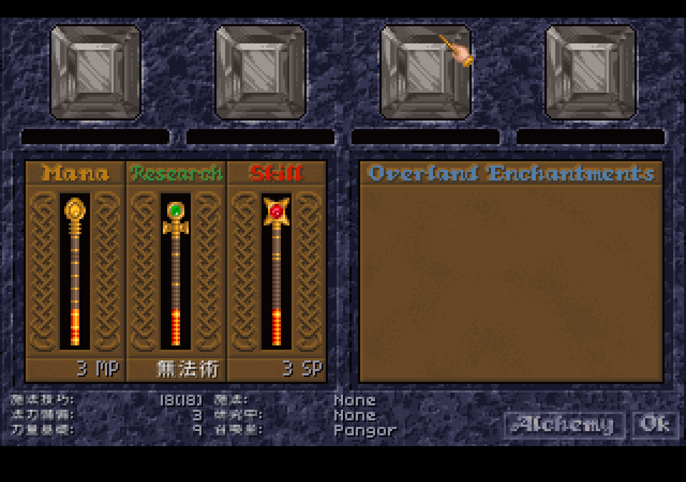
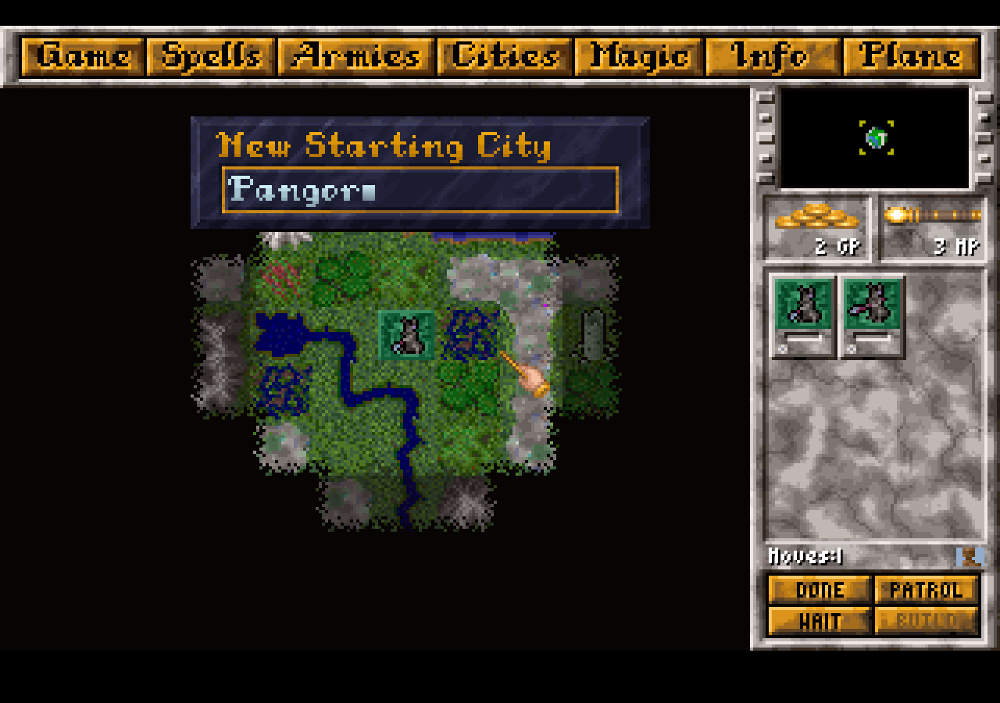

# AppImage 可玩性驗證 (game tester)

日期:2026-06-22。用打包好的 **AppImage**(非從源碼)headless 啟動、走真實遊戲畫面驗證。

## 結果:可玩性通過

- **AppImage 啟動成功**,從**內嵌的 1.60 遊戲資料**載入(`appimage_extracted/.../usr/share/mom-cht/data`),
  不依賴外部遊戲檔、不依賴系統字型或 `MOM_CHT_*` 環境變數(全 go:embed 內嵌)。
- **進入真實遊戲**(`-start`,隨機巫師開局,生成 200×150 雙位面地圖),overworld 渲染正常、可點選單導航、無崩潰。
- **CJK 從內嵌字型子集渲染**;**顯示層覆蓋層在真實遊戲畫面翻譯生效**。

### 翻譯生效實證(Magic 畫面)

font 繪製的欄位標籤已中文化:**施法技巧:**、**法力儲蓄:**、**力量基礎:**、**無法術**(No Spell)。

## 已知界線:烘進 LBX 的圖片 UI 仍英文

顯示層覆蓋層只能換**字型繪製的文字**。下列是**烘進版權 LBX 的點陣圖**(非 font),覆蓋層碰不到:

- 頂部選單列:Game / Spells / Armies / Cities / Magic / Info / Plane
- 畫面標題:Mana / Research / Skill / Overland Enchantments 等(花體 beveled 字)
- 按鈕:DONE / PATROL / WAIT / BUILD / Alchemy / Ok 等
- 組合/格式字串:`Moves:1`、數值串接(`%v Gold` 類)

要完全中文化這些,需要**圖片替換層**(在引擎載入 sprite 時替換成中文版圖片),屬獨立的美術工程
(萃取 LBX 圖、重繪含中文、載入時覆蓋),列為後續主要工作。

## 已中文化涵蓋(font 文字層)

| 類別 | 數量 | 來源 |
|---|---|---|
| 物品能力 | 64 | `item-powers.tsv` |
| 神器名 | 248 | `artifacts.tsv` |
| 法術名 | 213 | `spells.tsv` |
| UI 標籤/外交/設定/巫師建立/資源 | 106 | `ui.tsv` |
| **合計** | **631** | 顯示層覆蓋,1.31/1.60 通用 |

## 產出

- `dist/MasterOfMagic-CHT-x86_64.AppImage`(~40MB,含全 1.60 遊戲檔 + 內嵌中文化;版權檔不入公開 repo)。
- 執行:`./MasterOfMagic-CHT-x86_64.AppImage`(自帶資料,直接玩);或 `-start` 直接開局。
